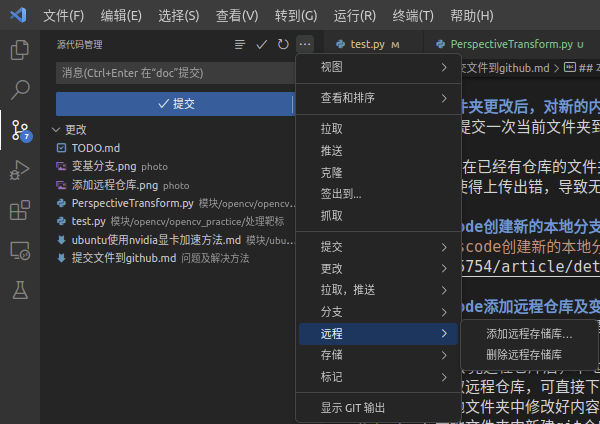
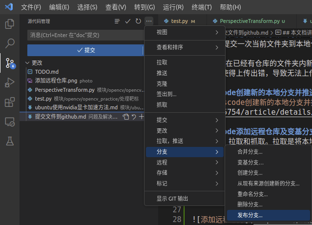

# git提交文件到github
**本文档讲解如何借助vscode的git GUI界面将自己的文件夹提交到github上**

> 2023.1.13

推荐下载git graph插件，便于查看github上传历史  

**建议使用vscode提交文件夹，方便快捷且便于后期维护仓库**

1. 使用vscode打开你想要提交的文件夹
2. 使用vscode左侧任务栏中的源代码管理功能创建本地git仓库
3. 提交当前文件夹到本地仓库
4. 发布本地仓库到github上，点击发布后可以在vscode中填写发布到github上的远程仓库的名称，然后vscode会自动在你的github上新建该远程仓库并且上传本地仓库
> 注意：一定要用vscode初始化本地仓库，这样vscode才有上传和后续同步的权限。不要在命令行使用`git init`初始化本地仓库，这样可能会出现vscode同步仓库失败的问题

### 文件夹更改后，对新的内容进行同步

- 只要再提交一次当前文件夹到本地仓库，然后选择同步到远程仓库即可

注意:不要在已经有仓库的文件夹内新建文件夹并新建仓库，然后上传那个新的文件夹。仓库的嵌套容易使得上传出错，导致无法上传。

### vscode创建新的本地分支并推送到远程仓库
见文章[vscode创建新的本地分支并推送到远程仓库](https://blog.csdn.net/m0_58185754/article/details/127518903)

### vscode添加远程仓库及变基分支操作
两个名词：拉取和抓取。拉取是将本地仓库与远程仓库合并。抓取是完全把远程仓库copy下来。        
需求：上传完远程仓库后，本地仓库删除，这时想要对远程仓库进行修改，并重新上传。
1. 先抓取远程仓库，可直接下载压缩文件
2. 在本地文件夹中修改好内容
3. 在本地文件夹中新建git仓库
4. 为本地仓库新增远程仓库

5. 变基分支。假设我们想要将当前内容上传到test仓库中的master分支，变基分支操作就是将当前内容的上传分支指定为test仓库中的master分支，以达到我们想要的效果

变基分支操作的详细内容和讲解可自行百度。

## git基本操作含义讲解 

### 1. 拉取
拉取是将远程仓库中的更改同步到本地仓库中，可以理解为“下行”

### 2. 推送
推送是将本地仓库中的更改同步到远程仓库中，可以理解为“上行”

### 3. 同步
同步是同时拉取并推送，即将远程仓库的更改同步到本地仓库中，又将本地仓库的更改同步到远程仓库中，可以理解为“上行+下行”

### 4. 创建新分支
创建新分支是在本地仓库中创建新分支，但是你可以将这个新分支推送到远程仓库中，这样远程仓库中也就有这个新分支了

### 5. 重命名分支
重命名分支是将本地仓库中的分支重新命名，并不会影响到远程仓库中分支的名字

### 6. 合并分支
合并分支是针对本地仓库的修改，将远程仓库中某个分支的内容合并到本地仓库中来，如果远程仓库内容比本地仓库多，则会给本地仓库增加所没有的内容，如果远程仓库内容比本地仓库少，则本地仓库内容不变，并不会减少。合并是远程仓库内容与本地仓库内容的叠加，叠加意为：文件数目叠加和单文件内容叠加。文件数目叠加就是如果远程仓库其他内容均与本地仓库一致，但是比本地仓库多出了`a.py`文件，则合并时会给本地仓库新增该`a.py`文件。单文件内容的叠加意思是如果本地仓库中`b.py`文件只写到了第六行，但是远程仓库中的`b.py`文件在前六行内容与本地仓库一致的前提下又多写了2行，则合并时会给本地仓库的`b.py`文件加上新增的那两行内容

如果遇到二者内容不同的地方（如本地仓库某文件第二行写的是a，远程仓库该文件第二行写的是b），称之为冲突。发生冲突时,vscode会让你选择此处使用远程仓库写的内容，还是本地仓库写的内容，还是二者内容叠加起来，全部保留。只有当远程仓库和本地仓库的冲突全部解决后，才能完成分支的合并。

### 7. 变基分支
变基意思就是改变基础。假设现在有分支A和分支B。分支A共有a,b,c，d,e,f三次提交。分支B共有x,y,z三次提交。分支A和B大部分内容相同，分支B是在分支A的c节点处被新创建的（每次提交就是一个节点）。此时如果将B变基到A，则本地仓库中B的历史提交会变成a,b,c,d,e,f,x,y,z。即将A的全部提交都作用于B分支后，再进行B自身的x,y,z三次提交。变基分支会打乱该分支的历史提交，一般多人协作时不使用，以免产生混乱。但是个人使用时，有时会很有用

## 在两台电脑上共同维护同一个远程仓库中的同一个分支
假设现在有两台电脑，称为a电脑和b电脑。其中a电脑放在公司，b电脑放在家中，你想要实现在家中和在公司都能对远程仓库中的分支z内容进行维护。方法如下：

1. a电脑先在本地创建分支z，然后将其推送到github远程仓库中
2. b电脑先在本地仓库中添加该远程仓库，然后拉取分支z的内容到本地仓库中。然后将b电脑的本地分支变基到分支z，最后将本地分支重命名为分支z的名字，再进行同步即可。

这样的话，如果在a电脑上向分支z提交了b电脑本地仓库没有的新内容，下次使用b电脑提交新内容时，同步会同时包含“上行”和“下行”。即会同时将b电脑的新内容推送到分支z，也会将a电脑提交的b所没有的内容拉取到b，这样就实现了两台电脑共同维护同一个分支z了

