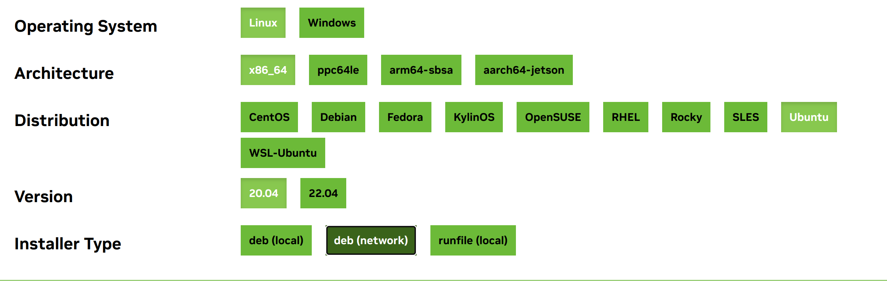

#
>2023.3.26

## 1. 下载pytorch和cuda驱动
见文章[3060显卡-yolov5-GPU环境搭建的一些建议](https://blog.csdn.net/a1729901831/article/details/123782788)中给出的链接。注意：不需要下载anaconda来创建什么虚拟环境。直接用电脑自己版本的python就可以了，如果报错缺什么库，直接pip装上相应库就可以了。
安装`CUDA Toolkit`时`install type`选择`deb(network)`。安装类型选择如下图所示：

## 2. 安装cuda
全部跟着cuda安装程序中的提示进行操作即可，每一步先别急着点，看完英文指引后再进行选择。如果实在不确定，必应搜索相关图文教程进行指导安装。  
中间很关键的一点：安装程序会问你要一个secure boot的密码。其实并不是要已有的密码，只是叫你现在在它的安装程序中设置一个这样的密码，后续要用到(我下载时在这里卡了很久，就是不知道这个密码是什么意思)

## 3. 启用cuda
安装完成后重启ubuntu，会进入一个蓝屏界面。
1. 当进入蓝色背景的界面perform mok management 后，选择 enroll mok , 
2. 进入enroll mok 界面，选择 continue , 
3. 进入enroll the key 界面，选择 yes , 
4. 接下来输入你在安装驱动时输入的密码，就是在`2.安装cuda`中强调的那个密码。它可能会让你输入该密码的第9位，第7位这样的一个个数字。稍微数一下位数再填即可。
5. 之后会跳到蓝色背景的界面perform mok management 选择第一个 reboot

这块可以参考文章[安装Ubuntu后重启出现perform MOK management](https://www.cnblogs.com/yutian-blogs/p/13019226.html#:~:text=%E5%AE%89%E8%A3%85%E5%AE%8C%E6%98%BE%E5%8D%A1%E9%A9%B1%E5%8A%A8%E5%90%8E%EF%BC%8C%E7%B3%BB%E7%BB%9F%E9%9C%80%E8%A6%81%E9%87%8D%E5%90%AF%E5%8A%A0%E8%BD%BD%E9%A9%B1%E5%8A%A8%EF%BC%8C%E5%9C%A8%E9%87%8D%E5%90%AF%E7%B3%BB%E7%BB%9F%E6%97%B6%EF%BC%8C%E4%BC%9A%E5%87%BA%E7%8E%B0%E4%B8%80%E4%B8%AA%E8%93%9D%E8%89%B2%E8%83%8C%E6%99%AF%E7%9A%84%E7%95%8C%E9%9D%A2%20perform%20mok%20management%2C%20%E9%80%89%E6%8B%A9%20continue%20reboot%EF%BC%8C%20%E5%8F%AF%E8%83%BD%E5%AF%BC%E8%87%B4%E6%96%B0%E5%AE%89%E8%A3%85%E7%9A%84,N%20%E5%8D%A1%E9%A9%B1%E5%8A%A8%E6%B2%A1%E6%9C%89%E5%8A%A0%E8%BD%BD%EF%BC%8C%E6%AD%A3%E7%A1%AE%E7%9A%84%E5%81%9A%E6%B3%95%E5%A6%82%E4%B8%8B%EF%BC%9A%20%281%29%E5%BD%93%E8%BF%9B%E5%85%A5%E8%93%9D%E8%89%B2%E8%83%8C%E6%99%AF%E7%9A%84%E7%95%8C%E9%9D%A2perform%20mok%20management%20%E5%90%8E%EF%BC%8C%E9%80%89%E6%8B%A9%20enroll%20mok%2C)和[ubuntu 20安装NVIDIA驱动并处理蓝色背景的界面 perform mok management](https://blog.csdn.net/u011573853/article/details/112312350)
