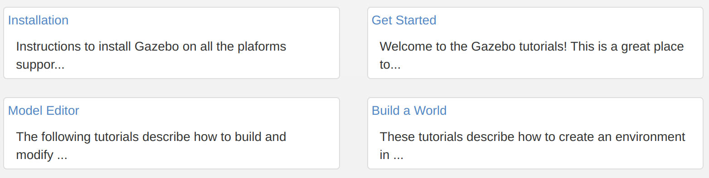

# SITL仿真方法
> 2023.7.28

**2023.7.26我运行ardupilot+ros+gazebo+QGC仿真成功，能够在ubuntu下跑侦查全流程仿真。  
整个过程耗时8天，碰到了很多的问题。本文档记录了从零开始进行SITL仿真的全部步骤，为学弟学妹铺平道路**

### 1. 下载和编译ardupilot仿真源码
后面都将ardupilot简称为AP
1. 从github下载官方最新源码  
`git clone --recurse-submodules https://github.com/your-github-account/ardupilot`  
详细下载方法见AP官方文档[Downloading the code](https://ardupilot.org/dev/docs/where-to-get-the-code.html)
2. 编译源码  
进入刚刚下载的`ardupilot`文件夹内，运行  
`Tools/environment_install/install-prereqs-ubuntu.sh -y`  
此处需要连接协会的网络翻墙，自己的clash翻墙可能不好使，会卡住。  
详细编译方法见AP官方文档[Setting up the Build Environment (Linux/Ubuntu)](https://ardupilot.org/dev/docs/building-setup-linux.html#building-setup-linux)

添加环境变量：将`export PATH=$PATH:$HOME/ardupilot/Tools/autotest`添加到`~/.bashrc`文件夹中。或者执行命令`echo "export PATH=$PATH:$HOME/ardupilot/Tools/autotest" >> ~/.bashrc。`方便以后使用该目录下的`sim_vehicle.py`

### 2. 阅读AP仿真文档
AP仿真文档：[Simulation](https://ardupilot.org/dev/docs/simulation-2.html#)

将该目录下的[SITL Simulator (Software in the Loop)](https://ardupilot.org/dev/docs/sitl-simulator-software-in-the-loop.html#)和[Using SITL with legacy versions of Gazebo](https://ardupilot.org/dev/docs/sitl-with-gazebo-legacy.html#sitl-with-gazebo-legacy)全部看完。  
1. 看完[SITL Simulator (Software in the Loop)](https://ardupilot.org/dev/docs/sitl-simulator-software-in-the-loop.html#)要学会`sim_vehicle.py`的使用方法，再结合命令行输入`sim_vehicle.py --help`查看该文件的使用说明，学会搭配`-v -f --out`等选项一起使用
2. 看完[Using SITL with legacy versions of Gazebo](https://ardupilot.org/dev/docs/sitl-with-gazebo-legacy.html#sitl-with-gazebo-legacy)能将ardupilot提供的gazebo模型库`ardupilot_gazebo`下载好并且按照其github仓库的文档配置gazebo环境变量,模型库下载[SwiftGust](https://github.com/SwiftGust/ardupilot_gazebo)版本的。还要学会使用gazebo打开该模型库提供的`.world`文件。我们仿真时主要是使用这个模型库里面提供的模型。
3. **gazebo环境变量讲解**：
    - `GAZEBO_MODEL_PATH`：配置gazebo模型文件的存放路径
    - `GAZEBO_RESOURCE_PATH`：配置gazebo世界文件的存放路径
    - `GAZEBO_PLUGIN_PATH`：配置gazebo插件文件的存放路径
4. **sdf模型文件中的uri标签讲解**：打开`ardupilot_gazebo/models/zephyr_delta_wing_ardupilot_demo/delta_wing.sdf`sdf模型文件，可以看到例如`<uri>model://zephyr_delta_wing`</uri>的内容。URI(Uniform Resource Identifier)意为统一资源标识符，它是一个字符串，用来标示抽象或物理资源。`model://zephyr_delta_wing`意为在`GAZEBO_MODEL_PATH`包含的路径中寻找模型`zephyr_delta_wing`。所以我们使用的模型所在的路径最好都添加进`GAZEBO_MODEL_PATH`环境变量中。如果没有添加还想要使用某个模型，需要将`model://zephyr_delta_wing`替换为该模型的绝对路径。

### 3.了解gazebo基本使用方法
阅读[gazebo官方文档](https://classic.gazebosim.org/tutorials)的入门部分，了解gazebo11界面的基本使用方法。需要阅读的内容为

阅读完后能够了解gazebo11界面的基本使用以及加深对gazebo的model和world的理解。

### 4. 使用地面站QGC
[QGC官方文档](https://docs.qgroundcontrol.com/master/en/index.html)  
下载QGC见其官方文档的[Download](https://docs.qgroundcontrol.com/master/en/getting_started/download_and_install.html)部分

AP官网提供的样例使用的地面站为mavproxy，我们可以使用其他任意地面站代替，这里推荐使用QGC地面站。

到这里，你应该能按照AP官网样例跑起来gazebo+sim_vehicle.py+QGC的联合仿真了。接下来要做的是根据侦查的需求修改仿真模型（加摄像头）和仿真环境（加靶标）。

       

