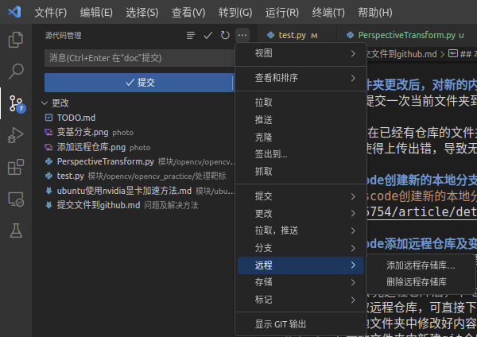
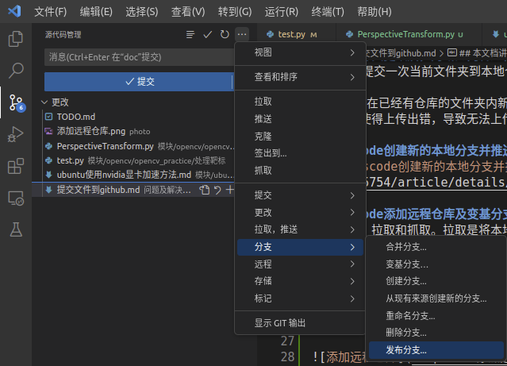

## 本文档讲解如何将自己的文件夹提交到github上
> 2023.1.13

**建议使用vscode提交文件夹，方便快捷且便于后期维护仓库**

1. 使用vscode打开你想要提交的文件夹
2. 使用vscode左侧任务栏中的源代码管理功能创建本地git仓库
3. 提交当前文件夹到本地仓库
4. 发布本地仓库到github上，点击发布后可以在vscode中填写发布到github上的远程仓库的名称，然后vscode会自动在你的github上新建该远程仓库并且上传本地仓库
> 注意：一定要用vscode初始化本地仓库，这样vscode才有上传和后续同步的权限。不要在命令行使用`git init`初始化本地仓库，这样可能会出现vscode同步仓库失败的问题

#### 文件夹更改后，对新的内容进行同步
- 只要再提交一次当前文件夹到本地仓库，然后选择同步到远程仓库即可

注意:不要在已经有仓库的文件夹内新建文件夹并新建仓库，然后上传那个新的文件夹。仓库的嵌套容易使得上传出错，导致无法上传。

### vscode创建新的本地分支并推送到远程仓库
见文章[vscode创建新的本地分支并推送到远程仓库](https://blog.csdn.net/m0_58185754/article/details/127518903)

### vscode添加远程仓库及变基分支操作
两个名词：拉取和抓取。拉取是将本地仓库与远程仓库合并。抓取是完全把远程仓库copy下来。        
需求：上传完远程仓库后，本地仓库删除，这时想要对远程仓库进行修改，并重新上传。
1. 先抓取远程仓库，可直接下载压缩文件
2. 在本地文件夹中修改好内容
3. 在本地文件夹中新建git仓库
4. 为本地仓库新增远程仓库

5. 变基分支。假设我们想要将当前内容上传到test仓库中的master分支，变基分支操作就是将当前内容的上传分支指定为test仓库中的master分支，以达到我们想要的效果

